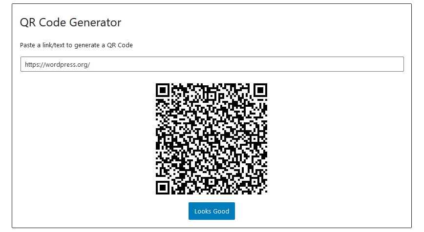
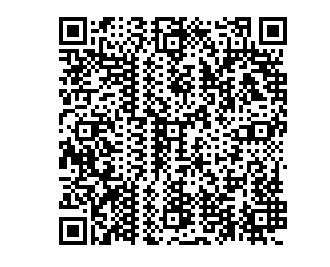

# QR Code Generator

## About
A simple QR Code generator made around [the library created by Kazuhiko Arase](https://kazuhikoarase.github.io/qrcode-generator/js/demo/) 

The word "QR Code" is registered trademark of [DENSO WAVE INCORPORATED](http://www.denso-wave.com/qrcode/faqpatent-e.html)

## Screenshots

## Installation

1. Upload the plugin files to the `/wp-content/plugins/qr-code-generator-block` directory, or install the plugin through the WordPress plugins screen directly.
1. Activate the plugin through the 'Plugins' screen in WordPress

## Changelog

### Version 1.0.0 
- Release
